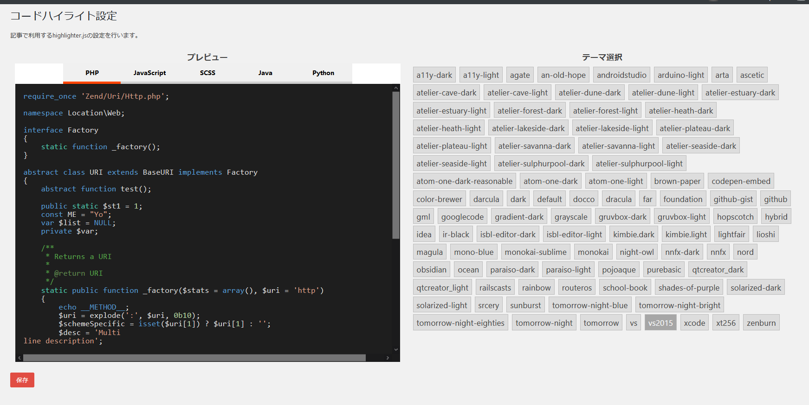

# easy-code-highlighter
Highlight.jsを一発でWordPressに導入するためのプラグインです。 
Highlight.jsをよくWordPressで使うので、サイト変えたときやテーマ編集・変更した際に、度々めんどくさかったのでプラグインにしました。  

<h2>使い方：How to use</h2>

プラグインを有効化した時点で、Highlight.jsが適用された状態になります。初期設定のままだと「default」テーマが適用されます。「設定」＞「コードハイライト設定」で、お好みのテーマを選択してください。

